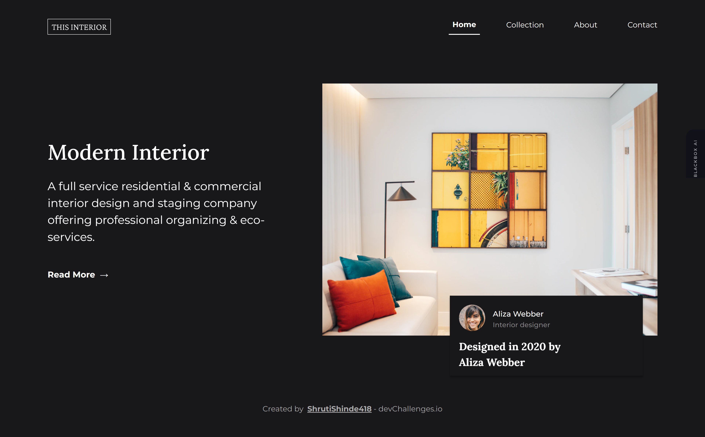

<h1 align="center">Interior Consultant Challenge using Bootstrap 5.1</h1>

   Solution for a challenge from  <a href="http://devchallenges.io" target="_blank">Devchallenges.io</a>.

  <h3>
    <a href="https://interior-consultant-hkaf2zt4l-shrutishinde418.vercel.app">
      Demo
    </a>
     | 
    <a href="https://github.com/ShrutiShinde418/DevChallenges/tree/main/interior-consultant">
      Solution
    </a>
     | 
    <a href="https://devchallenges.io/challenges/Jymh2b2FyebRTUljkNcb">
      Challenge
    </a>
  </h3>

<!-- TABLE OF CONTENTS -->

## Table of Contents

- [Table of Contents](#table-of-contents)
- [Overview](#overview)
  - [Built With](#built-with)
- [Acknowledgements](#acknowledgements)
- [Contact](#contact)

<!-- OVERVIEW -->

## Overview

### Built With

- [Bootstrap](https://getbootstrap.com/docs/5.1/getting-started/introduction/)
- Semantic HTML

This application/site was created as a submission to a [DevChallenges](https://devchallenges.io/challenges) challenge. The [challenge](https://devchallenges.io/challenges/Jymh2b2FyebRTUljkNcb) was to build an application to complete the given user stories.

## Acknowledgements

- [Offcanvas Tutorial](https://youtu.be/OFKBep95lb4)

## Contact

- GitHub [@ShrutiShinde418](https://github.com/ShrutiShinde418)

